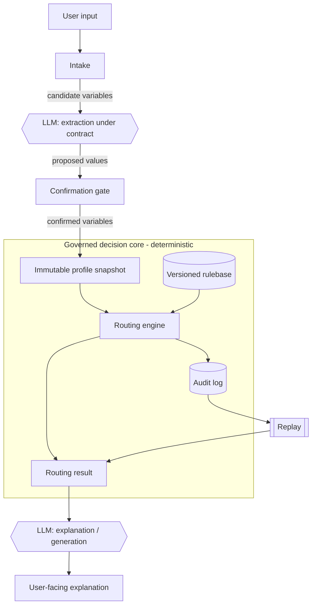

# Architecture Diagram

A component view of LuxPilot. The dashed box is the **governed decision core**;
the LLM sits outside it and only communicates.

## Reading the diagram

- **Intake + extraction** turn free text into *candidate* variables. The LLM
  may help here, but candidates are not trusted yet.
- **Confirmation gate** only lets confirmed variables through. This is the
  entry to the governed core.
- **Routing engine + rulebase** are fully deterministic. Same snapshot and
  rulebase version always yield the same result.
- **Audit log** records every execution and supports **replay**.
- **Explanation/generation** happens *after* the decision, and cannot change
  it.

## Key property

Only confirmed variables cross into the core, and no LLM call exists inside the
core. This is what makes routing deterministic, auditable, and replayable. See
`sequence-flow.md` for the temporal view and `../../PUBLIC_SPEC.md` for the
normative requirements.
