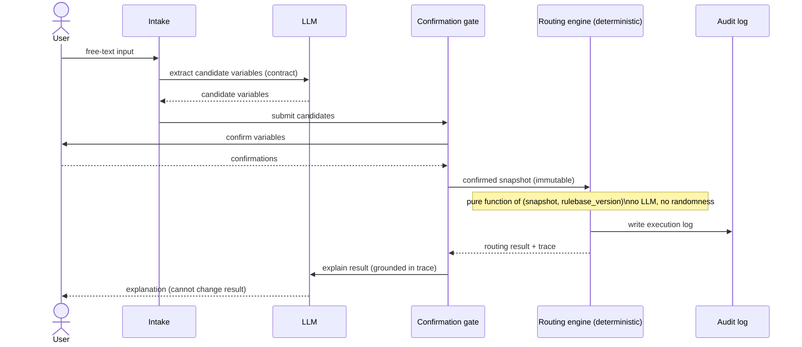
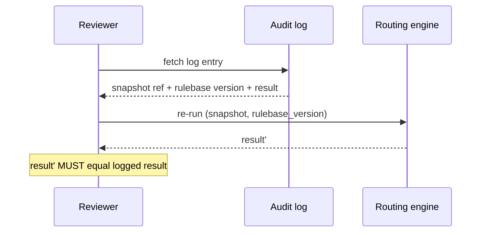

# Sequence Flow

A temporal view of one advisory interaction, emphasizing that the LLM is called
before and after the decision, but never during it.

## Notes

- The **only** inputs to the routing engine are the confirmed snapshot and the
  rulebase version.
- The **audit log** write happens as part of the same deterministic step, so
  every result is logged.
- The final LLM call is **downstream** of the decision and is constrained to
  the trace it is given.

## Replay view

See `architecture-diagram.md` for the component view and
`../../audit/replay-contract.md` for the replay contract.
